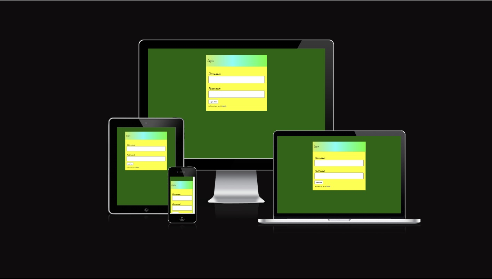
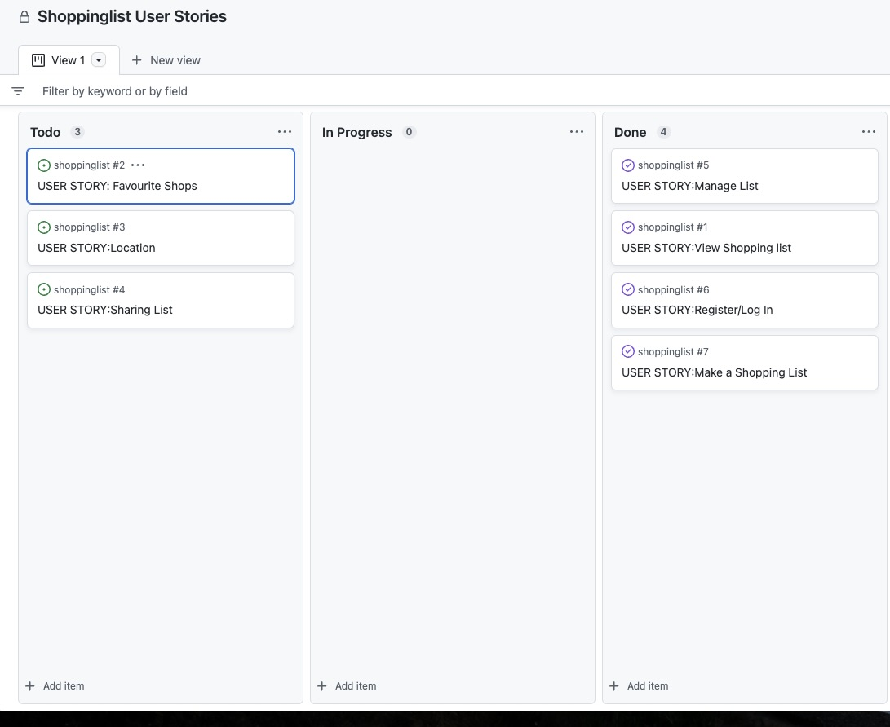
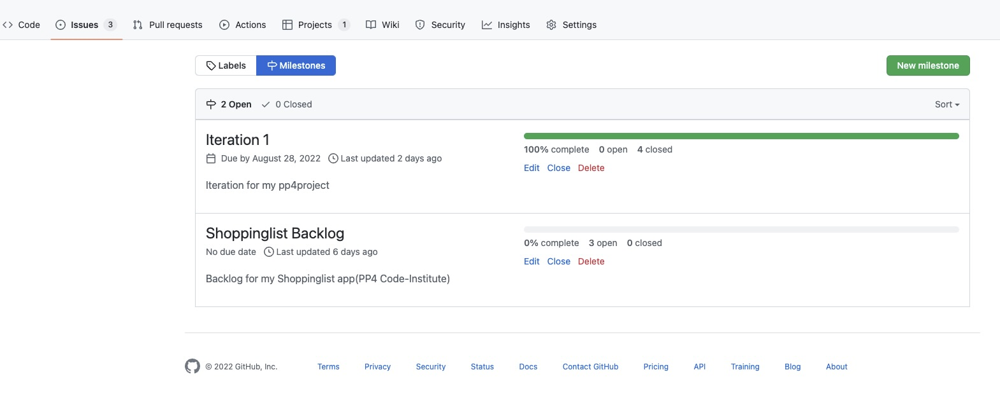
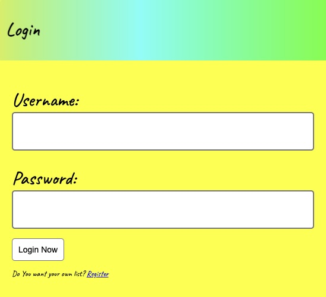
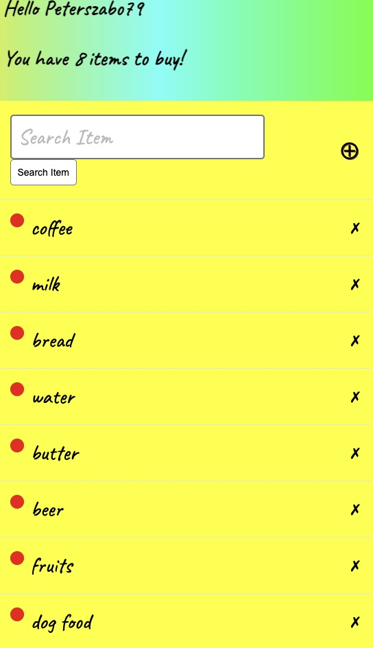
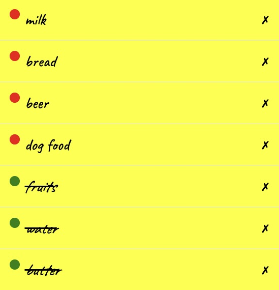
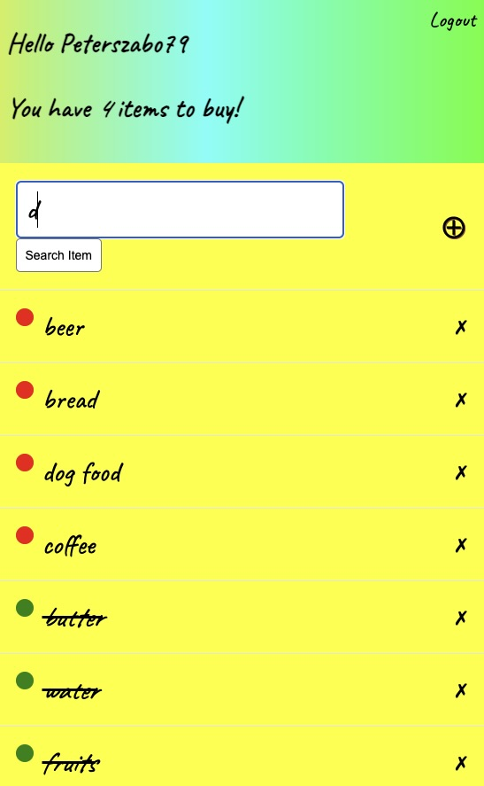
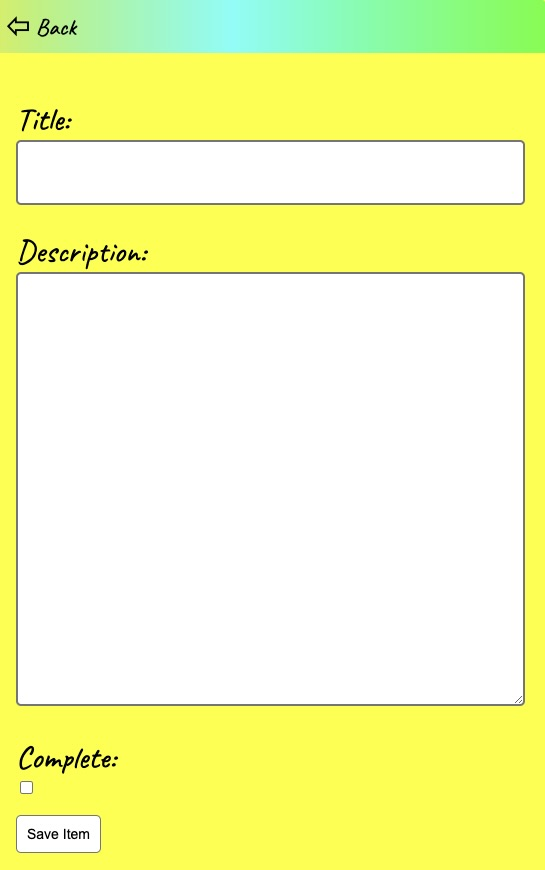
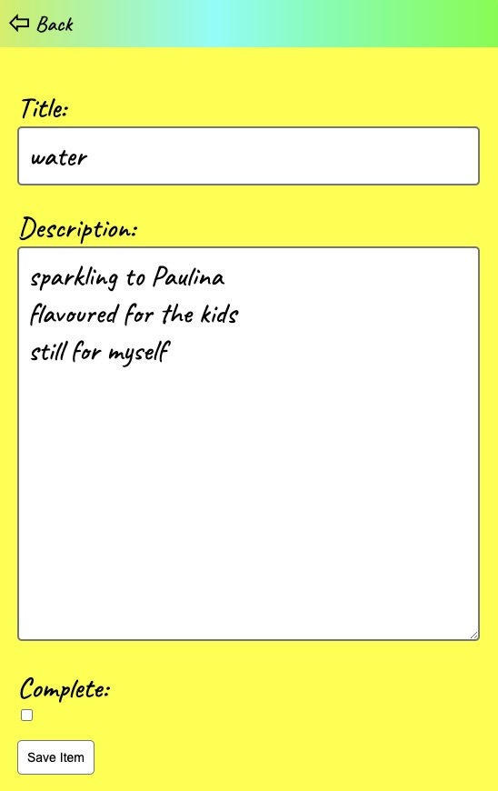
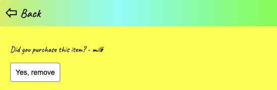

# Task Manager Shopping list application

### The live website can be seen [here](https://shoppinglistbypsz.herokuapp.com/login)

# UX
## Strategy 
### Agile
The Agile Methodology was used to plan this project. This was implemented through Github and the Project Board which can be seen here -  <a href="https://github.com/users/peterszabo79/projects/8/views/1" target="_blank"> Shopping List </a>

Through the use of the Kanban board in the projects view in Github, the project was divived into a few different sections:
* Backlog
* Current Iteration
* In Progress
* Done

* Projects were used to create the project.
* Issues were used to create User Stories with a custom template. Eash user story is clearly described with a title, statement, acceptance criteria and tasks.
* As work on a user story was begun the story was moved from the 'to do' column of the board to the 'In progress' column. When work on the story was complete the user story was moved into the 'done' column.

### Project Goal
#### The goal of the project is to create a Task Manager shopping list application website. 
* who wants to store, edit and delete their own items in one shopping list.

### User Stories 
   * As a Site User I can register in the app so that I can create my own shopping list
   * As a Site User I can log in 
   * As a Site User I can make a new shopping list
   * As a Site User I can view my list of items so I know what i have to purchase
   * As a Site User I can manage: add, delete, mark, update and read list 

### Scope
#### The ultimate goal was to allow logged in users to have full CRUD functionality for all their own content, time constraints meant this was limited to CRUD functionality for users only for their own tasks . More functionality for logged in users will be added in the future. 

### Structure
#### The website consists of six pages: Registration, Main page, Add Item, Search Item, View, Delete and Log In/Log Out pages. Log in and Registration can be viewed by all users. Shopping List page is limited to logged in users.

### Existing Features

#### Login page - existing user can login. 

#### Registration page - a new user can create an account adding his/her name ans password. 

#### Main page - will show user's name and user can add, edit, view, delete, search and see how many items on the list to buy. The items which are purchased will be marked with crossed out and green dot from the left handside. 

#### Search page - user can search for items typing in a first letter. 

#### Add item page - user can add a new item with a  "+" button. Title of item, description of the item,where to buy, how many to buy, complete button when item was pought, and save item button.  

#### View/Edit - when item was added we can add some description in description box. 

#### Complete - when item was purchased we can mark as complete. 

#### Delete - when item is bought user can delete it with "x" button from the right hand side. Before that it will appear a message - "Are you sure you want to delete this item?"

## Future Features
  * A useful future feature would be to add a map for favourite shops
  * Add an image field for User to save pictures their receipts
  * User sign-in with Google/Facebooks
  * Add sharing function via messeges or email

# Design
### The design style of the website is minimalist, shiny, but clean looking.
## Colours
  * The main colours are green and yellow

  * Font colours are black

## Typography
  * The fonts selected were: Caveat. These were selected for similarity as handwriting

# Technologies Used
## Languages

  * HTML5
  * CSS
  * Bootstrap 
  * Python
  * Django 
  * GitPod
  * GitHUb
  * Chroome DevTools
  * Heroku
  * Google Fonts

## Database

  * Heroku Postgres for the production database
  * SQLite for the local environment for automated testing

# Deployment

## Heroku
1. Creating the inital Django app
   * First follow these steps to create your app: add to local deployment section: here
   * Install Django and gunicorn: pip3 install django gunicorn
   * Install supporting database libraries dj_database_url and psycopg2 library: pip3 install dj_database_url psycopg2
   * Create file for requirements: in the terminal window type pip freeze --local > requirements.txt
   * Create project: in the terminal window type django-admin startproject project_name .
   * Create app: in the terminal window type python3 manage.py startapp app_name
   * Add app to list of installed apps in settings.py file: 'app_name'
   * Migrate changes: in the terminal window type python3 manage.py migrate
   * Run the server to test if the app is installed: in the terminal window type python3 manage.py runserver
   * If the app has been installed correctly the window will display The install worked successfully! Congratulations!

2. Create your Heroku app
   * Navigate to the Heroku website
   * In the Heroku browser window, create an account by entering your email address and a password
   * Activate the account through the authentication email sent to your email account
   * Click the new button and select create a new app from the dropdown menu
   * Enter a name for the application which must be unique, in this case the app name is 'shoppinglistbypsz'
   * Select a region, in this case Europe
   * Click create app

3. Create the Database
   * In the Heroku dashboard click on the Resources tab
   * Scroll down to Add-Ons, search for and select 'Heroku Postgres'
   * In the Settings tab, scroll down to 'Reveal Config Vars' and copy the text in the box beside DATABASE_URL.

4. Set up Environment Variables
   * In Gitpod create a new env.py file in the top level directory
   * Add env.py to the .gitignore file
   * In env.py import the os library
   * In env.py add os.environ["DATABASE_URL"] = "Paste in the text link copied above from Heroku DATABASE_URL" from step 3 Insert yours here
   * In env.py add os.environ["SECRET_KEY"] = "Make up your own random secret key"
   * In Heroku Settings tab Config Vars enter the same secret key created in env.py by entering 'SECRET_KEY' in the box for 'KEY' and your randomly created secret key in the 'value' box.
  
5. Connect the environment variables to Django
   * In your Django 'settings.py' file type:
     * from pathlib import Path
import os
import dj_database_url
if os.path.isfile("env.py"):
 import env
   * Remove the default insecure secret key in settings.py and replace with the link to the secret key variable i Heroku by typing: SECRET_KEY = os.environ.get(SECRET_KEY)
   * Comment out the DATABASES section in settings.py and replace with:
      * DATABASES = {
  'default': 
  dj_database_url.parse(os.environ.get("DATABASE_URL"))
  }`
6. Make migrations
   * In the terminal type:
      * python3 manage.py makemigrations`
      * python3 manage.py migrate`
7. Create Procfile in top level directory:
    * In Procfile add: web: gunicorn shoplist.wsgi

8. In terminal add, commit, and push:
    * git add <filename>
    * git commit -m 
    * git push

9. Heroku Deployment:
    * Click Deploy tab in Heroku
    * In the 'Deployment method' section select 'Github' and click the 'connect to Github' button to confirm.
    * In the 'search' box enter the Github repository name for the project: (https://github.com/peterszabo79/shoppinglist)
    * Click search and then click connect to link the heroku app with the Github repository. The box will confirm that heroku is connected to the repository.

10. Final Deployment
    * When development is complete change the debug setting to: DEBUG = False in settings.py
    * Because DEBUG must be switched to True for development and False for production it is recommended that only manual deployment is used in Heroku. The live deployment of the project can be seen [here](https://shoppinglistbypsz.herokuapp.com/login/)
# Testing
   * The testing phases have been carried out using the PIP8 Python Validator. No errors have been identified from the Validators.
   * W3C Markup Validation Service
   * W3C CSS Validation Service(Jigsaw)
   * Lighthouse Validator

## Additional Tests
   * Tests have been performed on Firefox, Opera, Chrome and Safari and the result is consistent in all the browsers on desktop and mobile devices
# Credits

  * [Django To Do List App With User Registration & Login](https://www.youtube.com/c/Desphixs) used his code for above application
  * Hello Django, I Think Therefore I Blog from Code Institute

# Acknowledgements

  ### There would have been no submission without the following people:
   * Everyone in the Slack community and my cohort class, especially: Ronan McGill and Claudio Crocilla
   * My mentor Spencer Barriball : for his endless knowledge, patience and advice
   * My friends and my family